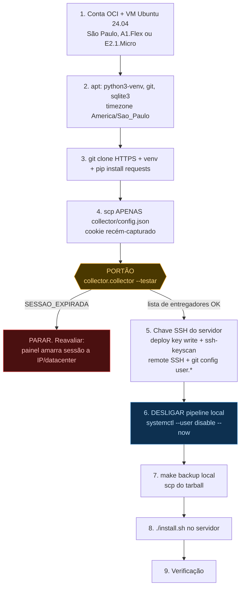

# Migração para Oracle Cloud (Always Free)

Runbook para tirar o coletor da máquina pessoal e pôr numa VM 24/7 sem custo
recorrente. Executar na ordem — o passo 4 é um **portão** que decide se a
migração é viável.

## Por que OCI

Grátis permanente, com região em São Paulo (IP brasileiro, o que reduz o risco do
painel Mais Delivery invalidar a sessão). A AWS foi descartada: o free tier novo
dura 6 meses e depois sai ~$9/mês.

## Infraestrutura

| Item | Escolha | Motivo |
|---|---|---|
| Região | **São Paulo (`sa-saopaulo-1`)** | IP brasileiro. **Escolher no cadastro** — é a *home region*, **irreversível**; recursos Always Free só existem nela. Vinhedo (`sa-vinhedo-1`) serve igual. |
| Shape | **VM.Standard.A1.Flex**, 1 OCPU / 6 GB (ARM) | ¼ da cota free (4 OCPU / 24 GB). `requests` é pure-python, roda em aarch64 sem drama. |
| Fallback | **VM.Standard.E2.1.Micro** (x86, 1 OCPU / 1 GB) | A capacidade de A1 vive esgotada (`Out of host capacity`). 1 GB sobra para 1 processo Python + SQLite. |
| SO | **Ubuntu 24.04 LTS** | Python 3.12, systemd igual ao Arch, usuário `ubuntu`. |
| Disco | Boot volume 50 GB (mínimo) | Dentro dos 200 GB free. |
| Rede | **Não abrir porta nenhuma** | O projeto não expõe serviço; o dashboard é servido pelo Cloudflare. |

## Ordem de execução



O passo 6 vem **antes** do 7 e 8 de propósito. O payload do relatório carrega
`gerado_em` (`collector/report.py:167`), então o HTML muda a cada ciclo e o
`deploy.sh` empurra sempre. Com local e servidor publicando no mesmo branch, os
dois brigam pelo mesmo `index.html` a cada poucos minutos. Custo de fazer nessa
ordem: um buraco de alguns minutos na coleta.

O `deploy.sh` aguenta a sobreposição sem travar — se o push é recusado ele tenta
rebase e, se o HTML conflitar, reconstrói o commit em cima do `origin` (o HTML é
artefato gerado, a versão mais recente vence). Mas isso é rede de segurança, não
licença para deixar os dois ligados: com dois publicadores o dashboard fica
oscilando entre as duas máquinas. Desligue o local.

---

## 1. Conta e instância

- Cadastro em oracle.com/cloud/free. Exige cartão para verificação (hold de ~$1);
  a conta fica Always Free até você pedir upgrade.
- **Na tela de cadastro, escolher São Paulo como home region. Irreversível.**
- Compute → Create Instance: image **Ubuntu 24.04**; shape `VM.Standard.A1.Flex`
  → 1 OCPU / 6 GB. Se der `Out of host capacity`, trocar para
  `VM.Standard.E2.1.Micro` (é comum em SP; não travar por isso). Confirmar o selo
  **"Always Free eligible"** na UI.
- SSH key: colar a pública de `~/.ssh/id_ed25519.pub` da máquina local.
- Anotar o IP público e reservá-lo como IP estático (2 reserved IPs entram no free).
- Rede: **não abrir nada**.

## 2. Preparar o servidor

```bash
ssh ubuntu@<IP>
sudo apt update && sudo apt install -y python3-venv git sqlite3
sudo timedatectl set-timezone America/Sao_Paulo
```

`sqlite3` vale instalar mas não é bloqueante: `scripts/backup.sh:16-17` prefere a
API `.backup` do CLI e cai num fallback Python funcional (`VACUUM INTO`,
`backup.sh:19-23`) se faltar — os dois dão snapshot consistente. O timezone alinha
os logs do journald e o `date` da mensagem de commit (`deploy.sh:26`) com o
`America/Sao_Paulo` que o `config.py:18` já usa internamente.

## 3. Clonar e criar a venv

```bash
git clone https://github.com/PedroGodoy-44/dadosmotoboy.git ~/projetos/motoboys
cd ~/projetos/motoboys
python3 -m venv .venv && .venv/bin/pip install -q -r collector/requirements.txt
```

HTTPS agora; o remote vira SSH no passo 5. A venv é criada à mão aqui só para
habilitar o portão — o `install.sh` do passo 8 a reaproveita (só cria se não
existir).

## 4. PORTÃO — testar a sessão do painel

**Decide a migração inteira.** Capturar um cURL **novo** no Firefox local
(F12 → Network → `ajax_operacao.php` → Copy as cURL) e importar antes de copiar;
um cookie velho daria um falso negativo que parece bloqueio por IP.

```bash
# local
make import CURL=curl.txt
scp collector/config.json ubuntu@<IP>:~/projetos/motoboys/collector/
# servidor
cd ~/projetos/motoboys && .venv/bin/python -m collector.collector --testar
```

Saída esperada: `HTTP 200 — N entregadores` e a tabela de nomes/estados. Se sair
`Sessao do painel expirou`, **parar aqui**: o painel provavelmente amarra sessão a
IP ou bloqueia faixas de datacenter. Alternativas a considerar: proxy residencial,
ou manter a coleta local e migrar só a publicação.

## 5. Identidade do servidor no GitHub

O `deploy.sh` dá push, então o servidor precisa de chave própria:

```bash
ssh-keygen -t ed25519 -N "" -f ~/.ssh/id_ed25519
ssh-keyscan github.com >> ~/.ssh/known_hosts     # NÃO PULAR
git remote set-url origin git@github.com:PedroGodoy-44/dadosmotoboy.git
git config user.name  "motoboys-server"
git config user.email "pedrohenriquegoodoy@gmail.com"
```

O `ssh-keyscan` não é opcional: o `deploy.sh` roda pelo `motoboys-deploy.service`,
sem TTY, e o primeiro push sem a host key conhecida falha com
`Host key verification failed` sem chance de responder "yes".

Cadastrar `~/.ssh/id_ed25519.pub` em GitHub → repo `dadosmotoboy` → Settings →
Deploy keys, **com "Allow write access" marcado**. Precisa ser chave nova (não a
do notebook): o GitHub não aceita a mesma pública como deploy key em dois lugares.

Validar antes de seguir: `ssh -T git@github.com` deve responder com o nome do repo.

## 6. Desligar o pipeline local

Na máquina local, **antes** de o servidor começar a publicar:

```bash
systemctl --user disable --now motoboys-collector.service \
  motoboys-report.timer motoboys-deploy.path
git -C ~/projetos/motoboys push        # garante que o origin está com tudo
```

## 7. Levar o estado

Nada disso vem no clone (tudo gitignored). Com o coletor local já parado, o banco
está frio — mas usar `make backup` mesmo assim é mais seguro e já traz o
`escala.csv` junto:

```bash
# local
make backup     # backups/motoboys-AAAAMMDD-HHMMSS.tar.gz
scp backups/motoboys-*.tar.gz ubuntu@<IP>:/tmp/
# servidor
tar -xzf /tmp/motoboys-*.tar.gz -C ~/projetos/motoboys/collector/ && rm /tmp/motoboys-*.tar.gz
```

O tarball contém `database.db`, `config.json` e `escala.csv` — nunca o `.env`.
O `config.json` já foi no passo 4; o tar só sobrescreve com o mesmo conteúdo.

**O `.env` não precisa ser copiado**: nenhum código lê `CLOUDFLARE_API_TOKEN` ou
`CF_PAGES_PROJECT` (o deploy é `git push` puro), e o `install.sh` cria um a partir
do `.env.example`.

## 8. Instalar

```bash
cd ~/projetos/motoboys && ./install.sh
```

Reaproveita a venv, roda `--init` (idempotente — o schema é todo
`CREATE TABLE IF NOT EXISTS`, então **não apaga** o banco copiado), instala as 5
units com `%BASE%` substituído, liga o linger e sobe tudo. Sem sudo.

## 9. Verificação

1. `journalctl --user -u motoboys-collector -f` — uma linha `N presentes de M
   cadastrados` a cada 3 min, **sem** `SESSAO_EXPIRADA`.
2. `systemctl --user list-timers | grep motoboys` — `motoboys-report.timer` armado.
3. `make status` — coletor + timer + watcher ativos.
4. Depois de um ciclo: `journalctl --user -u motoboys-deploy -n 50` — "Push enviado".
5. `git log --oneline -3` — commits `dashboard: atualiza ...` com autor
   `motoboys-server`, provando que a deploy key funciona.
6. Abrir o dashboard no Cloudflare Pages: o "gerado em" deve ter avançado.
7. `sudo reboot`, esperar, repetir 1–3 — valida linger + `enable` no boot.
8. Confirmar que a máquina local está quieta:
   `systemctl --user list-units 'motoboys-*'` não deve listar nada ativo.

---

## Operação depois da migração

**Renovar a sessão** (quando o log mostrar `SESSAO_EXPIRADA`), da máquina local:
```bash
export MOTOBOYS_HOST=ubuntu@SEU_IP    # ponha no ~/.bashrc
make push-sessao CURL=curl.txt
```

## Riscos operacionais

- **Reclamação por ociosidade** — o risco mais provável. A Oracle recupera
  instâncias Always Free ociosas (CPU sustentada abaixo de ~10–20% por 7 dias).
  Este projeto faz 1 request a cada 3 min: fica praticamente em 0%. Mitigação
  preferida: **upgrade da conta para Pay As You Go** — os recursos Always Free
  continuam grátis e deixam de ser elegíveis à reclamação. Alternativas: carga
  sintética de base, ou aceitar o risco com `make backup` em dia.
- **`--mock` é destrutivo** — `collector/mock.py:20-21` dá `DELETE FROM` nas
  tabelas do banco **real** e depois publica dados falsos no ar. **Nunca rodar
  `make mock` no servidor.**
- **Backups agora moram só na nuvem** — vale um `scp` periódico do
  `backups/*.tar.gz` do servidor para o notebook.
